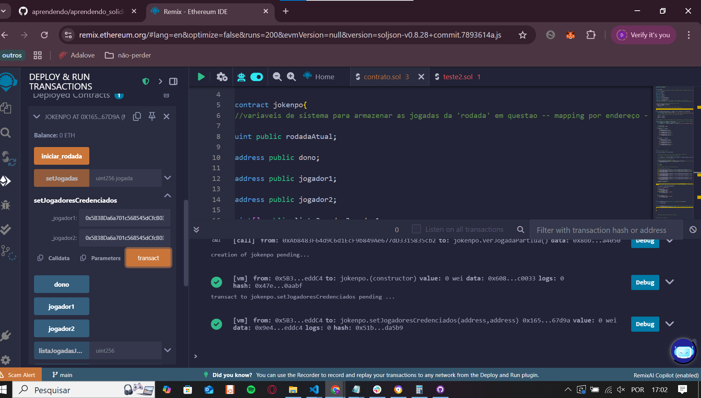
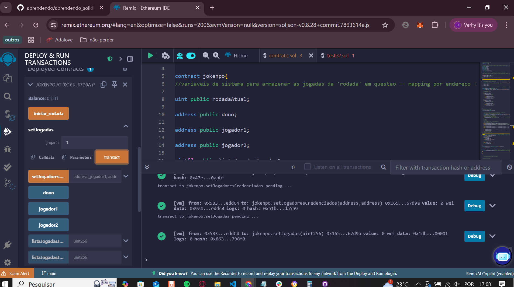
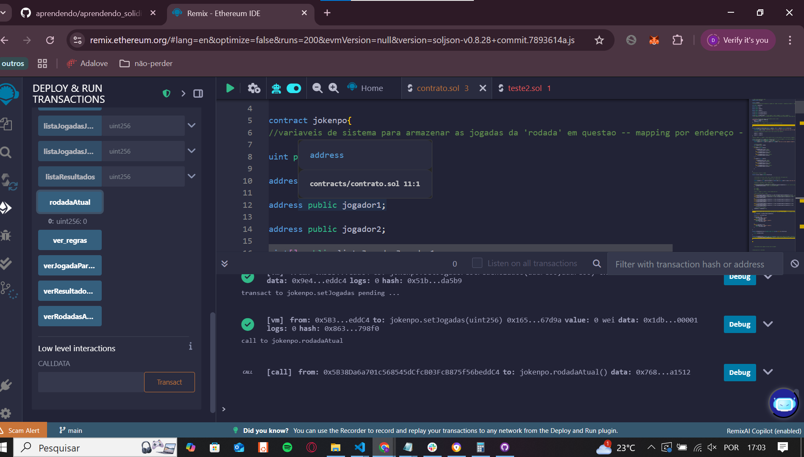
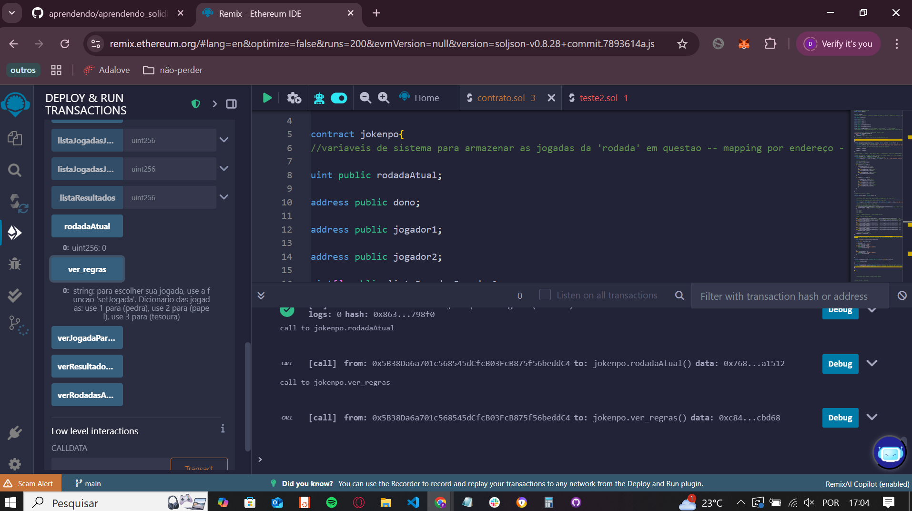
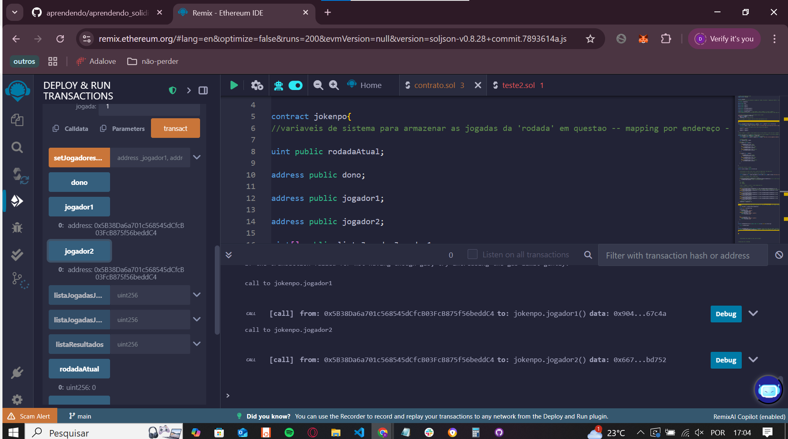
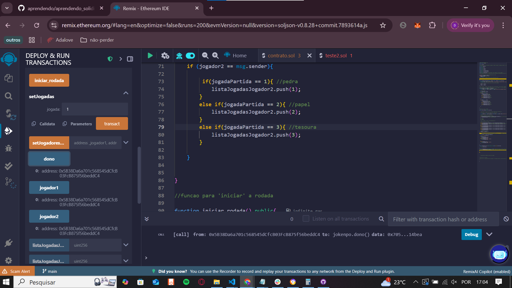
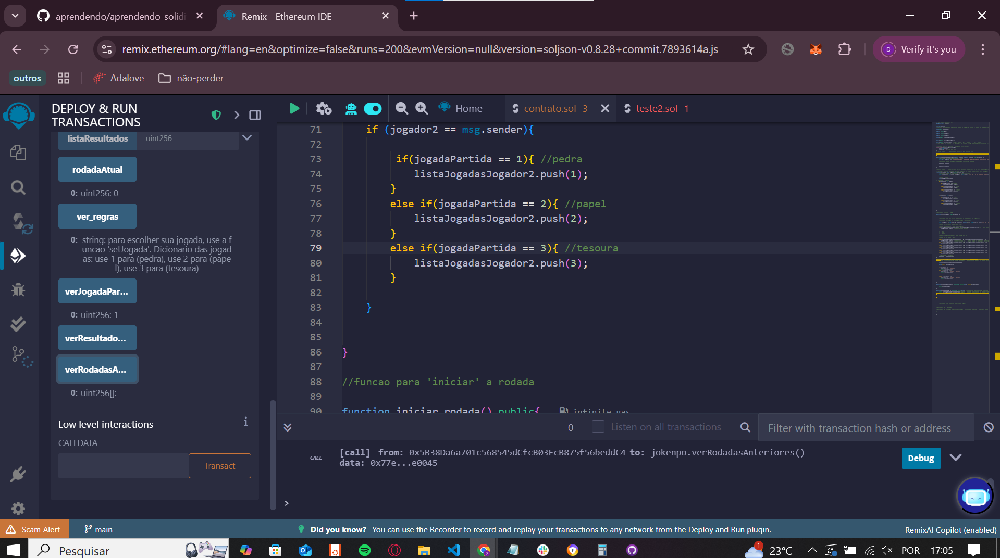
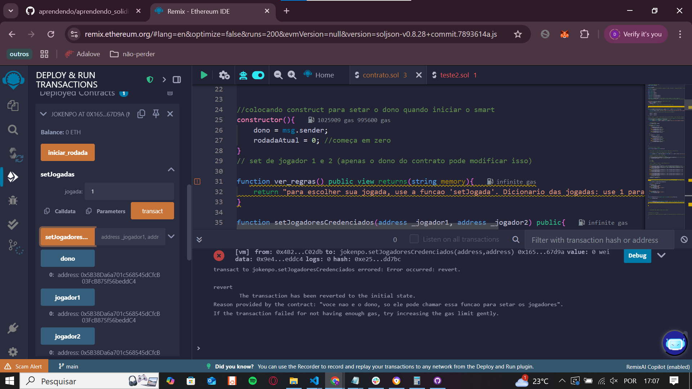

prints do funcionamento

//delimitando os jogadores

//fazendo a jogada

//verificando a partida atual

//verificando as regras

//vendo quem é o jogador 1 e quem é o jogador2

//vendo quem é o dono

//vendo lista de rodadas anteriores

//tentando acessar sem ser o dono
